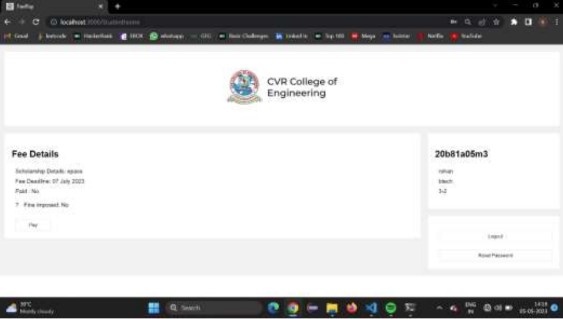
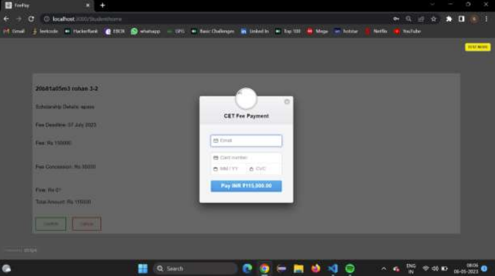
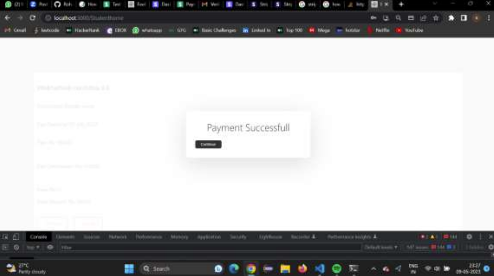
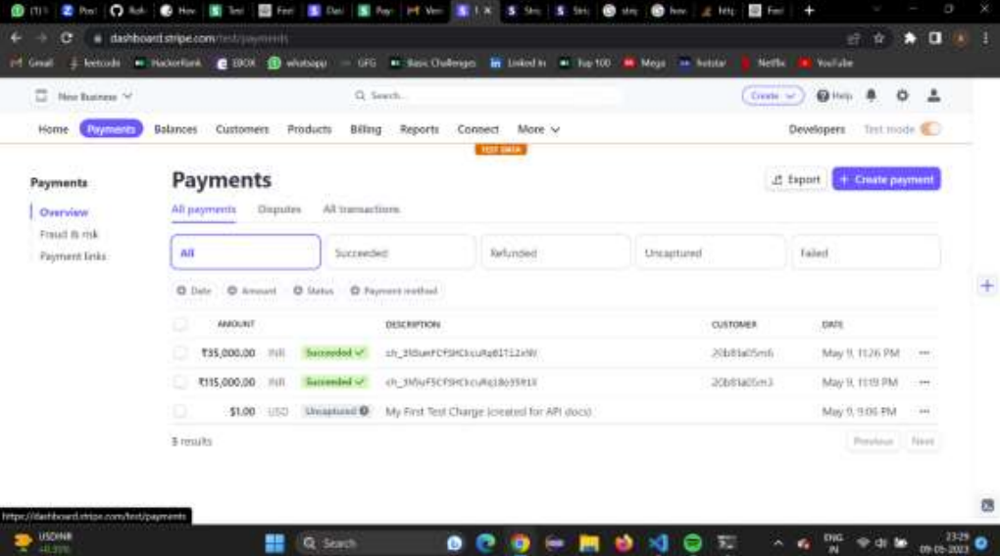

# 💳 Fee Automation System

A full-stack web application designed to automate and streamline the college fee payment process. This system enables students to securely pay their fees online and provides the administrative team with tools for real-time tracking, management, and reporting.

---

## 📌 Table of Contents

- [📖 Overview](#-overview)
- [✨ Features](#-features)
- [🛠 Tech Stack](#-tech-stack)
- [🏗 Architecture](#-architecture)
- [🧰 Setup Instructions](#-setup-instructions)
- [🚀 Usage](#-usage)
- [🖼 Screenshots](#-screenshots)
- [🔮 Future Enhancements](#-future-enhancements)
- [👨‍💻 Contributors](#-contributors)
- [📄 License](#-license)

---

## 📖 Overview

The Fee Automation System addresses the limitations of traditional fee collection methods which are often manual, error-prone, and lack transparency. The proposed system provides a secure, efficient, and user-friendly platform for both students and college administrators to handle fee payments and records.

### Benefits:
- Automation of fee calculation and payment processes
- Real-time updates on transaction status
- Integration with student information systems
- Reduction in administrative workload and human errors

---

## ✨ Features

- 🔐 Secure user registration and login system
- 🧾 Automatic fee calculation based on program and semester
- 💳 Online payment via Stripe gateway (supports debit/credit cards)
- 🕒 Late fee calculation for overdue payments
- 📊 Admin dashboard for monitoring all transactions
- 🔔 Real-time status update and receipt generation
- 📥 Optional: Email confirmation after payment

---

## 🛠 Tech Stack

### Frontend
- React.js
- HTML5 / CSS3

### Backend
- Node.js
- Express.js

### Database
- MySQL

### Payment Gateway
- Stripe API

---

## 🏗 Architecture

The system uses a 3-tier architecture:

```
+---------------------+       +---------------------+       +---------------------+
|   React Frontend    | <-->  |  Node.js Server/API | <-->  |     MySQL DB        |
+---------------------+       +---------------------+       +---------------------+
```

1. **Presentation Layer** – React frontend for user interaction
2. **Application Layer** – Node.js backend with Express for handling logic and APIs
3. **Data Layer** – MySQL database for storing users, fee details, and transactions

---

## 🧰 Setup Instructions

### Prerequisites
- Node.js and npm installed
- MySQL installed and running
- Stripe developer account

### Installation

1. **Clone the repository**
```bash
git clone https://github.com/your-username/fee-automation-system.git
cd fee-automation-system
```
2. **Install dependencies**
```bash
npm install
```
3. **Configure environment variables**
Create a `.env` file and add:
```ini
DB_HOST=localhost
DB_USER=root
DB_PASSWORD=yourpassword
DB_NAME=fee_system
PORT=3001
STRIPE_SECRET_KEY=sk_test_yourStripeSecretKey
REACT_APP_API_BASE_URL=http://localhost:3001
REACT_APP_STRIPE_KEY=pk_test_yourStripePublishableKey
CORS_WHITELIST=http://localhost:3000,http://localhost:3001
```
The `REACT_APP_API_BASE_URL` variable sets the base URL for API calls in the React app.
The `REACT_APP_STRIPE_KEY` variable supplies the Stripe publishable key to the React app.
The `CORS_WHITELIST` variable contains a comma-separated list of allowed origins for the backend.
The `PORT` variable sets the listening port for the Express server.

4. **Start the backend**
```bash
cd backend
npm start
```
5. **Start the frontend (from the repository root)**
```bash
npm install
npm start
```

6. **Run backend tests**
```bash
cd backend
npm test
```

---

## 🚀 Usage

**Students can:**
- Register/Login
- View fee details
- Pay online through Stripe
- Get instant payment confirmation

**Admins can:**
- Monitor all transactions
- View payment history on Stripe dashboard
- Download reports

---

## 🖼 Screenshots


| Page | Preview |
|------|---------|
| Login |  |
| Dashboard |  |
| Payment |  |
| Success |  |
| Admin |  |

---

## 🔮 Future Enhancements

- 🤖 AI/ML-based reminders
- 🔗 Blockchain payments
- 📱 Mobile apps
- 🎓 Scholarship module
- 🧾 PDF invoice generation

---

## 👨‍💻 Contributors

- **Chenna Sathvika** – `20B81A05N4`
- **Mukka Rohan** – `20B81A05M3`
- **Prathapuram Sai Rakshitha** – `20B81A05M6`

**Project Guide:**
**Mr. V.D.S. Krishna**
*Sr. Assistant Professor, CSE*
*CVR College of Engineering*

---

## 📄 License

This project is licensed under the [MIT License](https://opensource.org/licenses/MIT).